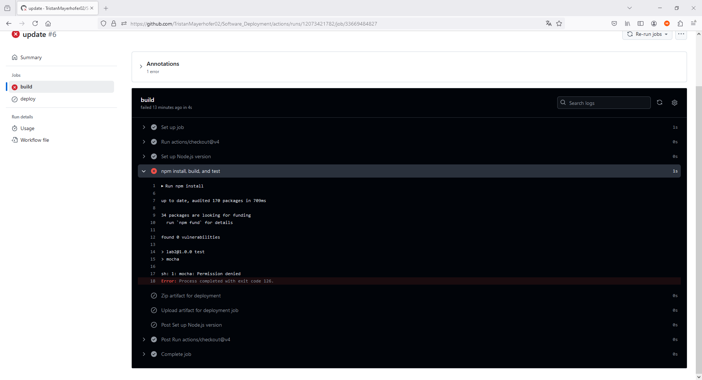
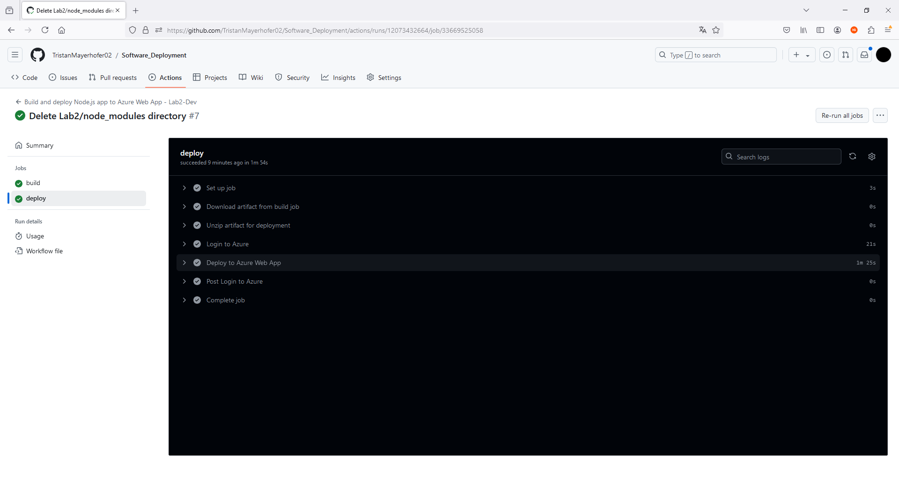
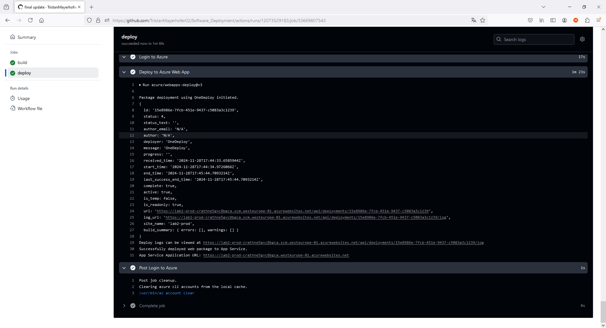

# Node.js Deployment auf Azure Web Apps
Dieses Projekt beinhaltet das Deployment einer Node.js Anwendung auf Azure Web Apps. Die Infrastruktur wird über GitHub Actions verwaltet, mit getrennten Umgebungen für Entwicklung und Produktion.

## Struktur

- **`Lab2/`**: Enthält die Node.js Anwendung:
  - **`index.js`**: Startpunkt der Anwendung.
  - **`package.json`**: Konfigurationsdatei mit Abhängigkeiten und Scripts.
  - **`app.test.js`**: Unit-Tests der Anwendung.
- **`.github/workflows/`**:
  - **`main.yml`**: GitHub Actions Workflow für die Entwicklungsumgebung.
  - **`release.yml`**: GitHub Actions Workflow für die Produktivumgebung.

## Anforderungen

- Ein aktives Azure Abonnement.
- Berechtigung zum Erstellen von Ressourcen in der Ziel-Ressourcengruppe.

## Links zu den Web Apps

- Entwicklungsumgebung (Lab2-Dev):** [lab2-dev-dsd4d3hya4h9d4f2.westeurope-01.azurewebsites.net](https://lab2-dev-dsd4d3hya4h9d4f2.westeurope-01.azurewebsites.net)
- Produktionsumgebung (Lab2-Prod):** [lab2-prod-crathne5gvc8bgca.westeurope-01.azurewebsites.net](https://lab2-prod-crathne5gvc8bgca.westeurope-01.azurewebsites.net)

## **Schritte für die Produktion**

Die Änderungen aus der Entwicklungsumgebung (Main-Branch) werden automatisch in die Produktionsumgebung übernommen, wenn ein Commit im Release-Branch erfolgt.

1. **Code in den Release-Branch committen:**
   - Führe Änderungen in den Release-Branch aus:
     ```bash
     git checkout release
     git commit -m "Update for production"
     git push origin release
     ```

2. **GitHub Actions Workflow überprüfen:**
   - Öffne das Tab **Actions** in deinem GitHub-Repository.
   - Die Änderungen werden automatisch in der Produktionsumgebung bereitgestellt.

## **Screenshots**

### Build, Test und Deployment (Entwicklungsumgebung)

- **Fehlgeschlagener Build:**

  

- **Erfolgreicher Build:**

  

### Release Pipeline (Produktionsumgebung)

- **Erfolgreiches Deployment:**

  

---

## **Technische Details**

- **Node.js-Version:** 20.x
- **Frameworks und Tools:**
  - `express`
  - `mocha`
  - `chai`
- **Test-Framework:** Mocha & Chai
- **Cloud-Dienste:** Azure Web Apps
