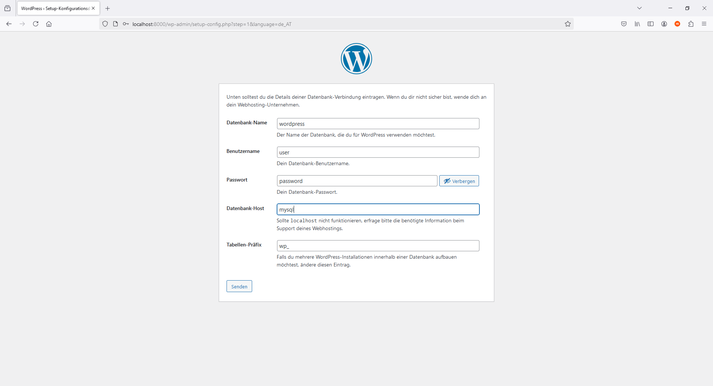

###WordPress Deployment
## **Teil 1: Verwendung offizieller Docker-Images**

### Ausführung
1. Navigiere in das Verzeichnis `Teil1`:
   ```bash
   cd Teil1
   ```

2. Starte die Container mit:
   ```bash
   docker-compose up -d
   ```

3. WordPress ist erreichbar unter:
   - [http://localhost:8000](http://localhost:8000)

### Technische Details
- **WordPress** läuft auf Port `8000`.
- **MariaDB** läuft auf Port `3306`.
- Persistente Volumes werden für die Datenbank und WordPress-Dateien verwendet.

---

## **Teil 2: Erstellung eigener Docker-Images**

### Ausführung
1. Navigiere in das Verzeichnis `Teil2`:
   ```bash
   cd Teil2
   ```

2. Baue und starte die Container mit:
   ```bash
   docker-compose up --build -d
   ```

3. WordPress ist erreichbar unter:
   - [http://localhost:8000](http://localhost:8000)

### Docker-Compose Übersicht
- **MariaDB:** Verwendet ein selbst erstelltes Docker-Image basierend auf Debian.
- **WordPress:** Verwendet ein selbst erstelltes Docker-Image mit Apache, PHP und WordPress.

---

## **Konfigurationsdetails**

### Datenbankverbindung (MariaDB)
Die MariaDB-Datenbank ist wie folgt konfiguriert:
- **Datenbankname:** `wordpress`
- **Benutzer:** `user`
- **Passwort:** `password`
- **Datenbank-Host:** `mysql:3306`

### WordPress-Einrichtung
Gib während der WordPress-Installation folgende Daten ein:


