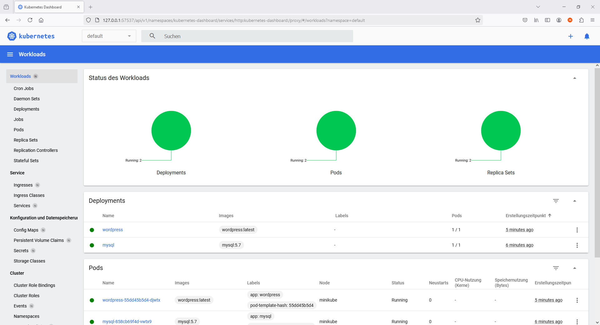
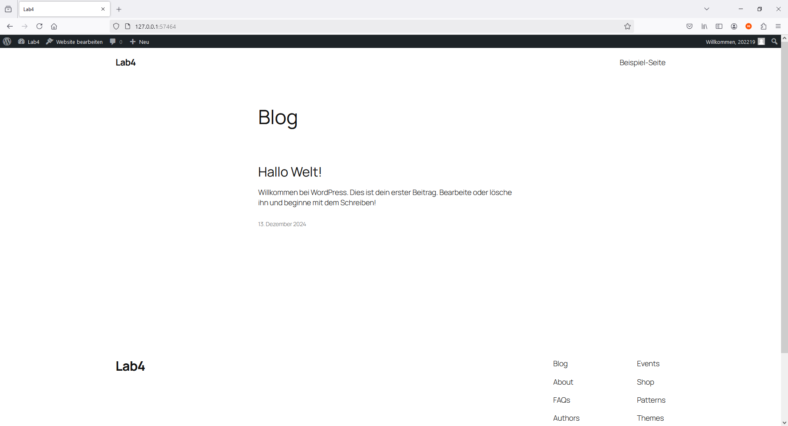

# **Lab4: Deployment von WordPress und MySQL in Minikube**

## **1. Screenshots**

1. **Cluster-Status**  
   Der Screenshot zeigt den Status der Deployments, Pods und Services im Kubernetes-Dashboard.  
   

2. **WordPress läuft erfolgreich**  
   Der Screenshot zeigt die gestartete WordPress-Seite.  
   

---

## **2. Dateien und Konfigurationen**

- `mysql-deployment.yaml`: Konfigurationsdatei für MySQL-Deployment und Service.  
- `wordpress-deployment.yaml`: Konfigurationsdatei für WordPress-Deployment und Service.

---

## **3. Notwendige Schritte für das Deployment**

1. **Minikube starten:**
   ```bash
   minikube start --driver=docker --cpus=4 --memory=4096
   ```

2. **Deployments ausführen:**
   ```bash
   kubectl apply -f mysql-deployment.yaml
   kubectl apply -f wordpress-deployment.yaml
   ```

3. **WordPress-Service öffnen:**
   ```bash
   minikube service wordpress-service --url
   ```

4. **Zugriff auf WordPress:**  
   Öffne die angezeigte URL im Browser:  
   `127.0.0.1:57464`